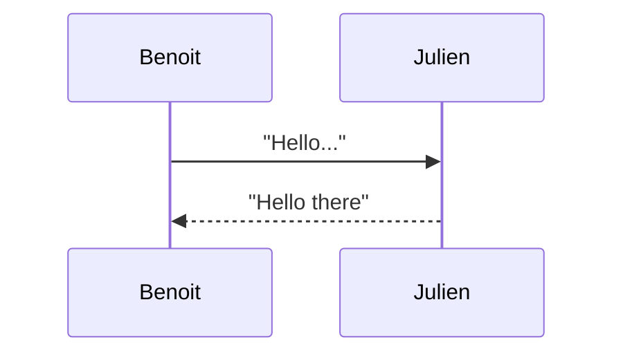
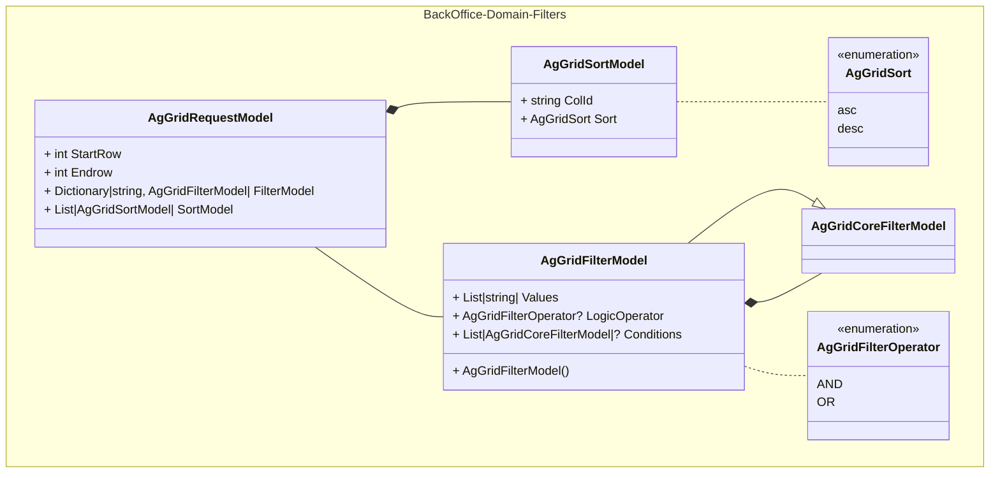
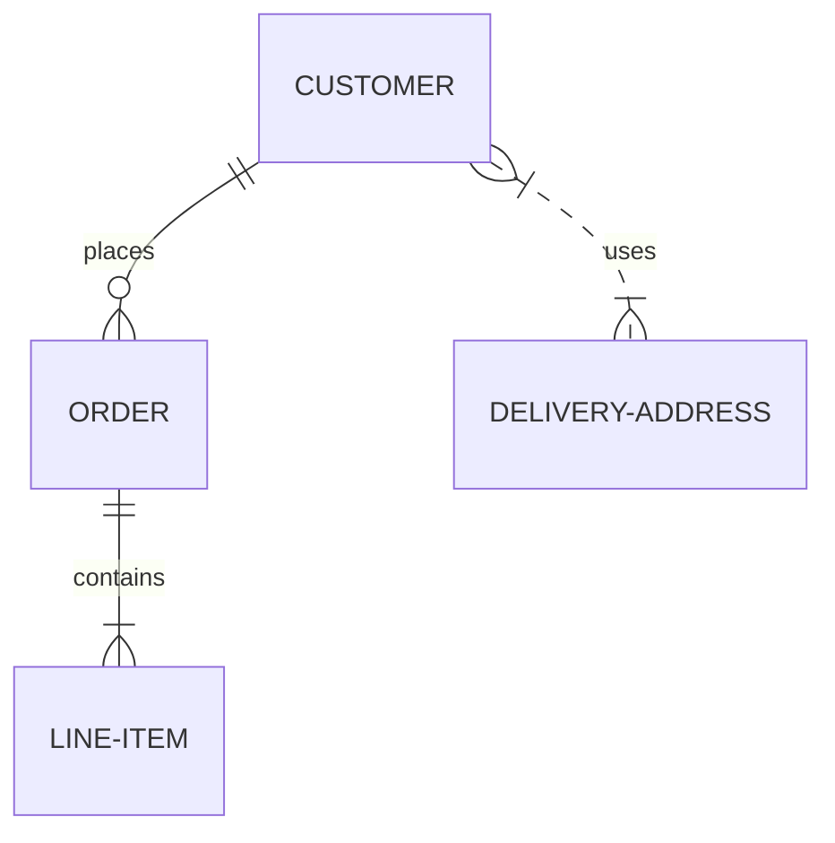

# Choisir un outil de diagrammes pour les intégrer aux fichiers markdown

- Date : 2023/09/22
- Décision prise par : Développeurs

## Contexte

Afin d'enrichir notre documentation intégrée au code, nous cherchons à nous doter d'un outil de génération de diagrammes.

## Options envisagées

1. **Diagrams.net**
    - Avantages :
        - outil en ligne
        - puissant, supporte de nombreux types de graphs
        - export en XML et en différent formats d'images

    - Inconvénients :
        - nécesaire d'utiliser l'app pour faire les diagrammes
        - manipulation d'import des XML et export des images
        - on pourrait versionner les XML source des diagrammes dans le repo

    [Site officiel](https://app.diagrams.net/)

2. **Mermaid**
    - Avantages :
        - permet de faire des diagrammes à partir d'instructions texte directement dans le markdown
        - s'embarque facilement dans un fichier markdown avec la balise `mermaid`
        - léger

    - Inconvénients :
        - limité sur les types de diagrammes
        - limité sur la mise en forme

    [Site officiel](http://mermaid.js.org/)

Exemples :

Se baser sur la documentation en ligne de Mermaid pour la syntaxe des diagrammes.

### Diagramme de séquence

### Diagramme de classes

### Diagramme relationnel

## Décision

Utilisation de mermaid car exécuté en live et ne nécessite pas d'images
Facile à intégrer dans un fichier markdown

## Conséquence

Penser à utiliser Mermaid et à proposer des schémas dans les README
Penser à installer l'extension [MarkDownEditor 2022](https://github.com/MadsKristensen/MarkdownEditor2022)
