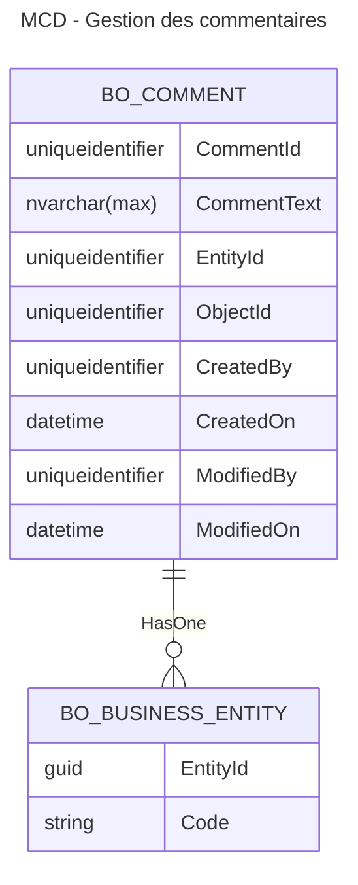

# Module générique de gestion de commentaires pour les entités métier

- Date : 2024/06/18
- Décision prise par : Développeurs, Architecte

## Contexte

Dans l'expression des besoins métier, il a été remonté la nécessité d'avoir un module permettant de saisir des commentaire
sur les contacts, les opérations immobilières, les lots, etc.

Pour les commentaires sur les contacts, le fonctionnement attendu est décrit dans les US BO-409, BO-410 et BO-412.

## Solution proposée

### Modèle de base de données



Nous avons fait en sorte de rester dans un design proche du design des tables du CRM dynamics.

Explications sur le schéma :
- `CommentId` sera la clé primaire
- `CommentText` contiendra le contenu HTML du commentaire
- Chaque commentaire sera relié à une entité métier via `EntityId` que l'on pourra retrouver via son `Code`
- L'instance de l'entité sur laquelle porte le commentaire sera stockée dans le champ `ObjectId`
- Auteur = `CreatedBy` et `ModifiedBy` correspondent à l'identifiant de l'utilisateur dans `SystemUser`

Des index devront être mis sur les propriétés `EntityId` et `ObjectId` afin d'avoir de bonnes performances
sur la lecture des commentaires.

Une requête de ce type permettra de charger les commentaire pour un contact, par exemple :

```sql
SELECT CommentId, CommentText, ObjectId, CreatedBy, CreatedOn, ModifiedBy, ModifiedOn
FROM bo_comment 
INNER JOIN bo_businness_entity ON bo_comment.EntityId = bo_businness_entity.EntityId
WHERE
    bo_businness_entity.Code = 'CONTACT'
    AND ObjectId = {contact-id}
```

<br/>

Nous proposons de remonter les informations de l'auteur via l'appel de la route 
`/api/{culture}/system-users/system-user/simplified/{user-id}`
afin de récupérer le nom et l'image de l'auteur.
Même principe que pour les auteurs de l'historique des modifications.

<br/>

Le système de notification de lecture sur les commentaires, prévu plus tard, pourra venir se greffer sur ce modèle en ajoutant une 
table permettant de déterminer pour chaque utilisateur le fait que le commentaire a été lu ou non.


### Routes d'API envisagées

#### Lecture

Pour que le système soit générique, nous proposons une route unique pour la récupération des commentaires :

`GET /api/{culture}/comments/{entity-code}/{object-id}/`

- `entity-code` : code de l'entité métier, ex : "CONTACT", "PROPERTY_TRANSACTION"
- `object-id` : GUID de l'entité pour laquelle on veut récupérer les commentaires

Format de la réponse
```json
{
    comments: [
        {
            commentId: "guid"
            commentText: "string"
            createdBy: "guid" /*auteur*/
            createdOn: "date time" /*date de création*/
            modifiedBy: "guid" /*auteur de la modification, null tant que pas de modifcation*/
            modifiedOn: "date time" /*date de modification, null tant que pas de modifcation*/
        },
        ...
    ],
    crmComment: "string"
}
```

Dans les cas spécifiques où l'entité avient déja des commentaires sur le CRM, ils seront ajoutés dans la propriété `crmComment`
sous la forme d'une chaîne de caractères.
<br/>
Ce commentaire spécifique sera affiché en lecture seule via l'interface du BO.


<br/>
Nous ne pensons pas qu'il soit nécessaire de mettre en place de la pagination, le volume des commentaires pour une même entité
sera très probablement faible.

#### Ajout

`POST /api/{culture}/comments/comment/`

avec un body
```json
{
    entityCode: "CONTACT",
    objectId: "guid",
    commentText: "string"
}
```

L'auteur sera l'utilisateur courant et récupéré automatiquement par le back 
via l'intercepteur en faisant hériter l'entité commentaire de IAuditableEntity

#### Modification

`PUT /api/{culture}/comments/comment/`

avec un body
```json
{
    commentId: "guid",
    commentText: "string"
}
```
Le modifiedBy devrait être mis à jour automatiquement par l'intercepteur de BD.

Seul l'auteur du commentaire pourra le modifier (le gérer par un Guard ?)

#### Suppression

`DEL /api/{culture}/comments/comment/{comment-id}`

Seul l'auteur du commentaire pourra le supprimer (le gérer par un Guard ?)


### Idées pour l'implémentation du code back

- Un controller et un service dédiés aux commentaires seront à mettre en place.
    - Quels droits mettre sur les routes du controller ?
- On peut utiliser le CRUD pattern et les Commands pour le service.
- Nouveau domain "Comments" avec une `CommentEntity : AuditableEntity, IEntity`
    - Mettre en place les guards sur l'entity lors du travail sur l'ajout/modification
- Un repository avec le CRUD pattern


## Décision
**A prendre à l'issu de la revue de conception**

