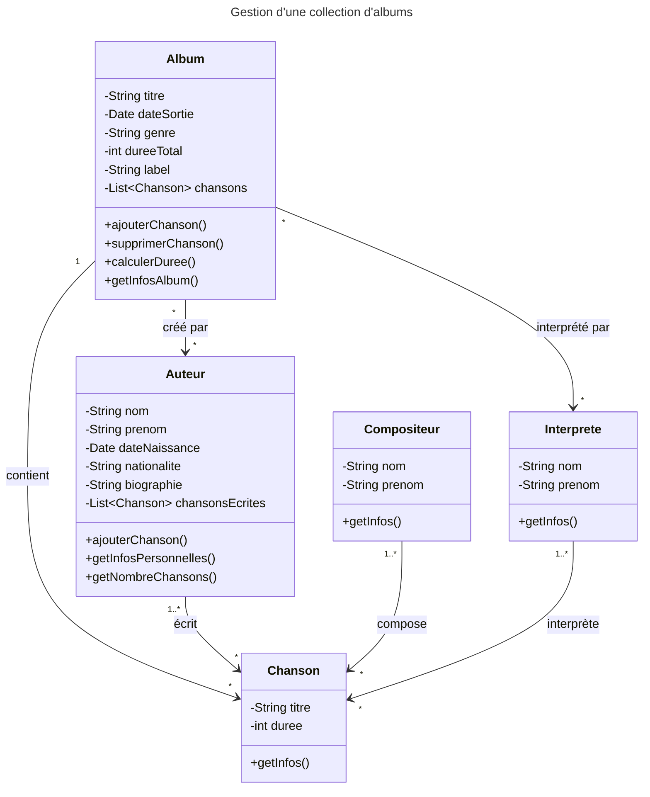

# Modèle CRC

Un modèle CRC (Class Responsibility Collaborator) est une collection de fiches standard qui sont été divisées en trois sections.

| Classname                        |                              |
| -------------------------------- | ---------------------------- |
| Responsabilities     | Collaborators    |

Une classe représente une collection d'objets similaires, une responsabilité est quelque chose qu'une classe connaît ou fait, et un collaborateur est une autre classe avec laquelle une classe interagit pour accomplir ses responsabilités

Le modèle CRC peut êtr utile pour décrire les entités sur un domaine métier.

---

## Exemple Modèle CRC - Collection d'Albums de Musique

| ALBUM                                 |                    |
| ------------------------------------- | ------------------ |
| **Responsabilités**                   | **Collaborateurs** |
| • Connaître son titre                 | • Chanson          |
| • Connaître sa date de sortie         | • Auteur           |
| • Connaître son genre musical         | • Interprète       |
| • Connaître sa durée totale           |                    |
| • Connaître son label                 |                    |
| • Maintenir la liste des chansons     |                    |
| • Ajouter/supprimer des chansons      |                    |
| • Calculer la durée totale            |                    |
| • Fournir les informations de l'album |                    |

| AUTEUR                                    |                    |
| ----------------------------------------- | ------------------ |
| **Responsabilités**                       | **Collaborateurs** |
| • Connaître son nom                       | • Chanson          |
| • Connaître son prénom                    | • Album            |
| • Connaître sa date de naissance          | • Compositeur      |
| • Connaître sa nationalité                | • Interprète       |
| • Connaître sa biographie                 |                    |
| • Maintenir la liste des chansons écrites |                    |
| • Ajouter une nouvelle chanson            |                    |
| • Fournir ses informations personnelles   |                    |
| • Calculer le nombre de chansons écrites  |                    |

### Diagramme de Classes simplifié 

Généré par IA à partir des modèles CRC et illustré avec Mermaid

### Description des Relations 

- **Album** contient plusieurs **Chansons** et collabore avec **Auteur** et **Interprète**
- **Auteur** écrit des **Chansons** et peut collaborer avec **Compositeur** et **Interprète**
- Les relations sont bidirectionnelles, permettant la navigation dans les deux sens
- Chaque classe maintient ses propres responsabilités tout en collaborant avec les autres pour accomplir les fonctionnalités du système